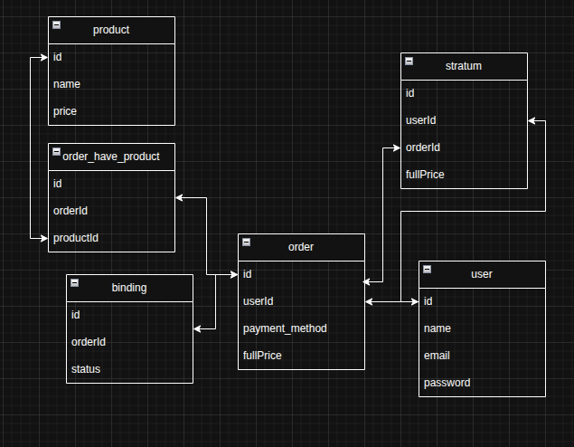

**com.weftecnologia.payment-api** it's a project where i challenged myself to create a payments api, following: 

**functional requirements**
- should recive PIX payments
- should credit card payments
- store user's purchases

**technical requirements**
- should have secure authentication
- one request must be made per user at a time

feel free to add more requirements.

# MER



how to run the project

check the .env-copy file for required environment variables.

first, set up the database connection (this project uses postgres):

```bash
URL_DATABASE=jdbc:postgresql://localhost:5432/payment_api
USER_DATABASE=weslleydev
USER_PASSWORD_DATABASE=secret123456
```

second, set a secret key to be used with jwt:

```bash
JWT_SECRET_KEY=abcd123456efg123456
```


flyway is used for database migrations. the user weslley is already added by default.

how to use the project

```bash
authentication
POST /auth
body:
{
  "email": "weslley@hotmail.com",
  "password": "123456789"
}
```

```bash
user
POST /user
body:
{
  "name": "",
  "email": "",
  "password": ""
}
```

```bash
order
POST /order
body:
{
  "paymentMethod": "pix",
  "products": [
    { "id": 99, "name": "Smartphone", "price": 1200.50 }
  ]
}
```

```bash
payment
GET /payment/{pixcode}
```

```bash
product
POST /product/get-all
body:
{
  "page": integer,
  "size": integer
}
```

usage flow

log in and set the returned token in the bearer authorization header.

create an order with the mock data (you can fetch products using the /product/get-all endpoint).

make the pix payment using the /payment endpoint with the pix code received from the /order request.